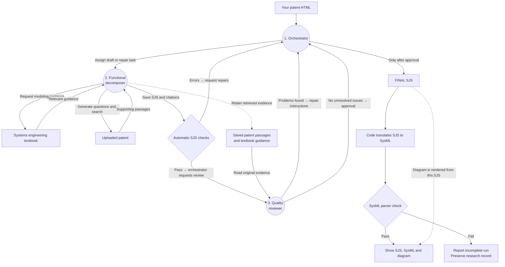

# Live agent workflow: patent to SJS

The [live app](https://cmuchancel-patent2sysml.hf.space/) uses **three agents: one orchestrator and two subagents**. A subagent is an AI worker that receives assignments from the orchestrator. The decomposer also makes repairs; there is no separate repair agent.

**SJS is the primary model output.** SysML translation and diagram rendering happen afterward through ordinary code.

This diagram describes the deployed Hugging Face Space, verified on September 24, 2026 at revision [`838255e`](https://huggingface.co/spaces/cmuchancel/patent2sysml/tree/838255eafcdb387b929aebfb94875a798e8916a2). It is a deployment snapshot; other source revisions can differ.

## Full flow

Circles are agents. Rectangles are data, tools or outputs. Diamonds are automatic checks. Solid arrows show work or information moving between steps; dotted arrows show retained evidence or the source of a derived output.

## Who does what?

| Agent | Responsibility |
| --- | --- |
| Orchestrator | Assigns work, reads the saved workflow status, routes errors/findings back for repair, and finalizes the approved SJS. |
| Functional decomposer | Reads patent context, retrieves textbook guidance, generates patent-specific questions, searches the patent, writes SJS with citations, and repairs the saved model. |
| Quality reviewer | Reads the candidate and cited evidence, checks grounding and completeness, records findings, and reviews repaired revisions. It does not edit the model. |

The subagents run **sequentially**. The repair cycle is **reviewer → orchestrator → decomposer → automatic checks → reviewer**, repeating within the run time limit. Structural errors can send a draft directly back for repair before review. The orchestrator waits for each assignment to finish.

The reviewer checks patent grounding, functional completeness, flow consistency, claim traceability, interfaces and application of textbook guidance. Unresolved warning/error findings block finalization.

## Code and research records

Automatic SJS checks validate the schema, IDs and references, citations, compatible ports/flows, and translation round-trip. These checks are code, not additional agents.

After SJS approval, the pinned GradResearch translator emits its profile and a compatibility step produces portable SysML. The pinned SysIDE Legacy parser checks that output. A parser failure currently reports an incomplete run; it does not automatically start another agent repair cycle. The diagram is rendered from the saved SJS, not by reading the generated SysML.

Research recording runs throughout. The private archive retains the uploaded patent, retrieved evidence, questions, agent conversations, model drafts, review findings, repair attempts, validation results and outputs. The host cleans up the run's patent search collection on success or failure; retained research evidence remains in the archive. Login credentials are excluded.

## Verification snapshot

The deployed revision was checked against a completed run for `US10036408B2` (`patent-90u_85t_`):

- Completed in approximately **6 minutes 23 seconds**.
- Reviewer approved SJS revision 3 after repairs.
- SJS translation round-trip passed.
- Generated SysML passed the pinned parser with **zero diagnostics**.
- Research archive persistence and collection cleanup succeeded.

This demonstrates a working end-to-end run, not guaranteed correctness for every patent. Reviewer approval and parser validation do not prove engineering accuracy or completeness. The parser is SysIDE Legacy 0.9.1 with its 2024-12 library, not certification against the final SysML 2.0 specification.

Deployment sources: [agent configuration and output processing](https://huggingface.co/spaces/cmuchancel/patent2sysml/blob/838255eafcdb387b929aebfb94875a798e8916a2/agent_runner.py), [agent instructions](https://huggingface.co/spaces/cmuchancel/patent2sysml/blob/838255eafcdb387b929aebfb94875a798e8916a2/workflow.py), [workflow checks and finalization](https://huggingface.co/spaces/cmuchancel/patent2sysml/blob/838255eafcdb387b929aebfb94875a798e8916a2/workspace_mcp.py).
