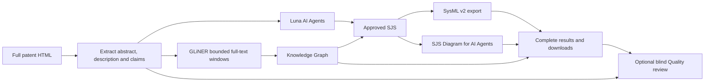

# Prototype architecture

Production entry: `space_app.py` → `app.space` → `app.main`. Startup installs pinned parser/renderer and OpenCode runtimes, fetches private reference/translator assets and loads the checksum-verified GLiNER checkpoint. The main module builds and queues Gradio with its CSS/JavaScript.

| Package | Responsibility |
|---|---|
| `app` | Patent/example loading, method selection, login, simple status, final-only reveal |
| `backend` | Validation, result contract, routing, diagrams, artifact files, visitor sessions and research archive |
| `agentic` | Luna/OpenCode orchestration, tools, approved SJS and blind review |
| `fine_tuned_nlp` | Corpus/training, checkpoint loading, full-patent windows, reconciliation, graph and SJS export |
| `src/funcqual` | Separate reference-free profile evaluator, not the UI reviewer |

## Contracts and complete results

`backend.patent.validate_patent` accepts patent HTML and extracts all available abstract/description/claims with a source SHA-256. Empty/non-patent input is rejected before model calls. The example uses the same validator.

`backend.service.process_results(file, session=None, method='agents')` streams source, knowledge_graph, sjs, sysml, quality, status, run_id and method. The UI clears old output at the start and publishes the final successful snapshot only after stream exhaustion. Partial artifacts may remain on the server for diagnosis; errors restore controls and keep incomplete output hidden.

Agents displays the actual approved SJS component names/functions/flows in its SJS Diagram. NLP displays the extracted Knowledge Graph. Both retain SJS/SysML source and downloads. No SysML diagram tab is presented. The graph refits when its panel becomes visible. Quality review hides results while working, then restores the final review.

## Full-patent NLP and export

`fine_tuned_nlp.cloud` loads the unchanged checksum-pinned checkpoint and decorates bounded inference batches with `spaces.GPU`. `schema_knowledge_graph.py` creates model-context windows, preserves whole-source mention offsets and merges repeated predictions. `sjs_knowledge_graph.py` runs the configured definition passes; graph, SJS and SysML are assembled afterward. There is no arbitrary document-token cap, but quota/resources/timeouts apply.

Training chunks (384 source tokens maximum) differ from deployment windows. The entity-only training labels describe SysML code; inference applies prose prompts to patents. Domain transfer is documented rather than called measured patent accuracy. The pinned Legacy parser provides repeatable diagnostics, not certification against final SysML 2.0. Unresolved mappings remain in reports.

## Sessions and storage

OpenAI device-code credentials live in isolated visitor sessions. Agent records and outputs are archived privately; credentials are excluded and the UI discloses retention. `backend.research` records source/runtime/model/tool provenance. Licensed textbook assets remain private. Public example output contains final artifacts and review, not full conversations or credentials.

See [setup](PROTOTYPE_SETUP.md), [evaluation](EVALUATION.md), [agent flow](AGENT_FLOW.md) and [research archive](RESEARCH_RECORD.md).
