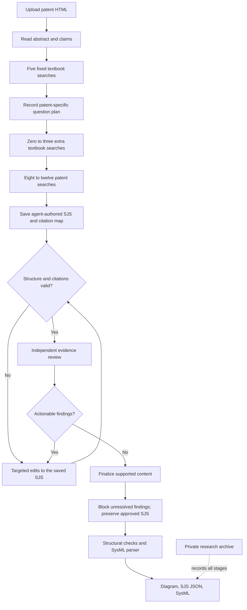

# Implemented research workflow

The app uses three OpenCode agents with the same configured model (`OPENCODE_MODEL`, default `openai/gpt-6-luna`). Each hosted visitor signs into their own ChatGPT account. Python controls file access, question budgets, review gates, cleanup, validation and persistence.

| Agent | Job |
| --- | --- |
| Orchestrator | Delegate each stage sequentially and finalize the reviewed result. |
| Functional decomposer | Read patent context, plan questions, retrieve evidence, draft SJS directly and make targeted repairs to the saved model. |
| Quality reviewer | Independently read the candidate and its cited passages, record findings, and review the repaired candidate. It cannot edit the model. |

## Fixed and dynamic questions

These five textbook queries remain unchanged and are enforced in order:

1. `functional decomposition verb noun pairs`
2. `black-box model inputs outputs flows`
3. `system interfaces context diagram`
4. `control regulation mechanisms`
5. `inventive claims novel functional elements`

The backend textbook is indexed once using the teammate's BM25 subsection retriever. Its saved index is rebuilt only when the book or extraction code changes. Each run searches that same index; no new embedding of the book is needed.

The decomposer first reads the uploaded patent's abstract and claims. If neither HTML selector exists, it receives a labeled body excerpt. Long context is explicitly marked as truncated. After the fixed searches, it saves a plan containing a patent summary, 0–3 modeling uncertainties, and 8–12 patent questions. Each uncertainty records the concrete patent context, the reason for asking, and a textbook query expressed in systems-engineering terms. Each patent question records its context, category and purpose.

For example, a patent describing a bellows and hydraulic reaction chambers might lead to a textbook query about `system boundary interface energy material signal flow classification`. The textbook supplies modeling guidance; the uploaded patent supplies evidence about the bellows. Textbook passages cannot establish invention facts.

Tool guards require the planned searches and enforce their budgets. Textbook retrieval uses `top_k=1`, with 4,000 characters per subsection. Patent retrieval uses `top_k=5`. Successful duplicate searches are rejected; failed calls remain recorded and can be retried.

## SJS review and repair

The initial draft is immutable. Code checks the GradResearch SJS contract, citations, unique IDs, subsystem and port references, compatible flow types/directions, action owners, allocations and state targets. Research metadata and citation pointers stay outside SJS. These checks establish consistency, not factual support.

The reviewer receives the candidate, context and evidence catalog. Exact passages are read in batches of at most three to avoid tool-response truncation. Every cited, available patent passage must have been opened before review can be saved. Six required review categories cover patent grounding, functional completeness, flow consistency, claim traceability, interfaces and textbook application. Findings include severity, an exact model JSON pointer, supporting evidence IDs and a suggested correction. Missing-content findings have no removal target.

Structural errors are corrected before independent review. Actionable findings trigger targeted edits to the saved SJS, with up to three extra searches per repair plan when evidence is missing. Full-model replacement is forbidden after the initial draft. Unmentioned content is preserved, citations follow their objects when array indexes change, and new items require citations. Edit lists and their change explanations are recorded. Invalid proposals are retained in the research record but cannot overwrite the current candidate. Every accepted revision requires a fresh independent review.

Repair and review repeat until approval, bounded by the configured agent run timeout and agent step budgets. Unresolved warnings/errors block a successful final product; there is no one-repair cutoff. The repair agent must remove unsupported assertions and update affected references and citations itself; the host never silently rewrites the reviewed SJS. Drafts, assumptions, findings and evidence remain in the research ZIP. The final `.sjs.json` is the exact approved model, without a research wrapper.

## Export and cleanup

The host clears this run's patent collection on success, failure or cancellation, and records the cleanup result. This never clears the textbook index. Captured research evidence remains retained by design.

The agents use an explicit SJS contract rather than the upstream five-view JSON prompt. GradResearch's translator is pinned to `31502a702beb92a79b8a156bf5e615f4bc8d1df6`, downloaded privately and hash-checked. It produces an original `.profile.sysml`, and reversing that profile must preserve the canonical SJS exactly. Unsupported fields fail validation instead of disappearing.

The upstream `@sjs` annotations are a custom profile, not valid syntax for the installed SysIDE parser. A deterministic compatibility projection builds component definitions/usages, typed ports, directed flows and action allocations from the round-tripped SJS. Descriptive action steps, state conditions and requirement satisfaction remain documentation; this is not an executable simulation. Both outputs are retained, and the downloadable portable `.sysml` must pass pinned SysIDE Legacy 0.9.1 (2024-12). Passing that parser is not certification against final SysML 2.0. The diagram reads the same approved SJS interfaces. UI outputs are read from those saved artifacts, not generated independently.

The Gradio interface reveals methods after upload and requires an explicit selection before exposing Process. AI agents opens a session-specific sign-in popup, which closes after connection. Results are revealed after processing; the three tabs remain Diagram, SJS model, and SysML download. A research ZIP download is inside the JSON tab. The uploader accepts patent HTML (.html or .htm) only. JSON is available as an output download and cannot be uploaded as input.

## Research record and persistence

See [RESEARCH_RECORD.md](RESEARCH_RECORD.md) for file layout, metric meanings, storage setup and limitations. The agents have only their named MCP tools; shell, general file access and external browsing are denied. Backend service tokens never reach agent subprocess environments. The original teammate code remains unchanged under `agentic/vendor/Info-extraction`; hosted behavior lives in small Python modules and `agentic/workflow.py`.
