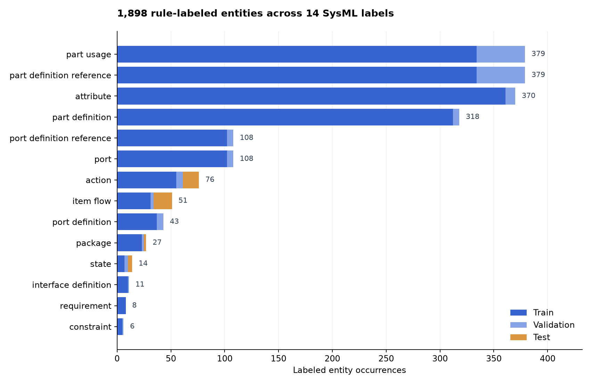

---
language:
- en
license: other
license_name: unspecified-source-data-rights
license_link: https://huggingface.co/datasets/cmuchancel/gliner-sysml-training-data/blob/main/RIGHTS.md
task_categories:
- token-classification
pretty_name: SysML GLiNER Training Data — 1,898 Entity Labels
size_categories:
- n<1K
tags:
- sysml
- gliner
- weak-supervision
- systems-engineering
configs:
- config_name: chunks
  default: true
  data_files:
  - split: train
    path: chunks/train.jsonl
  - split: validation
    path: chunks/validation.jsonl
  - split: test
    path: chunks/test.jsonl
- config_name: entities
  data_files:
  - split: train
    path: entities/train.jsonl
  - split: validation
    path: entities/validation.jsonl
  - split: test
    path: entities/test.jsonl
---

# SysML GLiNER Training Data

**1,898 labeled entity spans · 14 label types · 25 SysML documents · 62 training/evaluation chunks.**

This is the actual weakly supervised corpus used to fine-tune [GLiNER RelEx checkpoint 450](https://huggingface.co/spaces/cmuchancel/patent2sysml/blob/main/model_cards/GLINER.md) for the [Patent to SysML prototype](https://huggingface.co/spaces/cmuchancel/patent2sysml). The live interface offers AI Agents using Luna and Fine-Tuned NLP using this checkpoint. This dataset trained GLiNER; it did not train Luna.

The labels describe SysML source code, principally related linear-actuator examples with additional practice/sequence examples. They were generated by deterministic rules after translator validation. **The 1,898 labels are annotated occurrences, not 1,898 independent documents or manually annotated samples.**

## At a glance

| Split | Source documents | Chunks | Labeled spans | Chunks without entities |
|---|---:|---:|---:|---:|
| Train | 21 | 54 | 1,721 | 12 |
| Validation | 2 | 5 | 139 | 2 |
| Test | 2 | 3 | 38 | 0 |
| **Total** | **25** | **62** | **1,898** | **14** |

Chunks contain at most **384 source tokens**, using the project's SysML tokenizer. These are not the encoder's subword tokens. The original split seed is **42**. Every source document belongs to one split. Related examples remain across splits, so document separation does not establish independent design-family separation.



Full split-specific counts, token lengths, negative examples and source filenames are in [eda.json](eda.json). [provenance.json](provenance.json) records original-file hashes; [SHA256SUMS](SHA256SUMS) covers the published package.

## Load and explore

```python
from datasets import load_dataset

chunks = load_dataset("cmuchancel/gliner-sysml-training-data", "chunks")
entities = load_dataset("cmuchancel/gliner-sysml-training-data", "entities")
print(len(chunks["train"]))       # 54
print(len(entities["train"]))     # 1721 labeled occurrences
print(chunks["train"][0])
```

Two viewer configurations expose the same annotations:

| Configuration | Row unit | Important fields |
|---|---|---|
| `chunks` (default) | One context chunk | `chunk_id`, `document_id`, `source_path`, `text`, `tokens`, `candidate_labels`, `entities` |
| `entities` | One labeled occurrence | `entity_id`, `chunk_id`, `document_id`, `source_path`, `start_token`, `end_token`, `label`, `text` |

`entities` is a convenient annotation index, **not an independently collected 1,898-sample corpus**. Join it to `chunks` using `chunk_id` for context. `start_token` and `end_token` are **inclusive**, relative to `tokens` in that chunk. `text` in the entities configuration is the labeled entity; `text` in chunks is the exact source slice. `annotation_method` is `translator-rule`. `token_start`/`token_end` in metadata are the half-open document-token interval for the chunk.

To produce the original GLiNER input shape from a viewer row:

```python
row = chunks["train"][0]
gliner_row = {
    "tokenized_text": row["tokens"],
    "ner": [[e["start_token"], e["end_token"], e["label"]] for e in row["entities"]],
    "label": row["candidate_labels"],
}
```

For exact reproduction, download `original/splits/{train,validation,test}.json` and their metadata files. Those training JSON files are retained byte-for-byte, including entity-free negative examples and all 14 candidate labels. `original/canonical/documents.json` contains the full SysML text, character spans and translated SJS. Character offsets there are half-open: `text[start:end]`. Its `confidence: 1.0` is a fixed rule marker, not calibrated model confidence.

## Collection and annotation

The supplied corpus entered the project in contributor **eandujar09 (Eladio)**'s [source commit](https://github.com/cmuchancel/24679-project-1/commit/0ad817e45e86fec1884ee402077600d652e70bff). The original contributor commit was `e708b60dea0148615e7b7b3fc0583e4f5b8f394e`; the linked commit is its cleaned-history equivalent after removing an upstream browser key from patent HTML. SysML source texts and GLiNER split bytes are unchanged. The original sibling `SysML-files` directory was not committed, but all 25 accepted source texts are preserved in canonical documents. Original upstream authorship beyond this contribution was not recorded; no manual collection or manual span-review count is established.

The preparation pipeline:

1. Reads SysML files and deduplicates identical normalized text by SHA-256.
2. Runs the supplied translator; translator-rejected documents are quarantined. The supplied build records zero errors. Translator acceptance does not guarantee semantic correctness; the corpus includes an explicitly named semantic-mistake example.
3. Masks embedded `@sjs` JSON payloads when applying labeling rules, preserving character offsets. This prevents labeling those payload contents; the surrounding source text remains in the context.
4. Applies syntax patterns for names and references, then verifies every labeled character slice matches its recorded text.
5. Assigns documents to splits before dividing them into non-overlapping chunks; shifts spans to chunk-relative inclusive token offsets. The single `default` project group forced document-level splitting.
6. Retains entity-free chunks and exports fixed train/validation/test JSON.

The [labeling pipeline](https://github.com/cmuchancel/24679-project-1/blob/main/fine_tuned_nlp/src/sysml_gliner/pipeline.py) and [Hub packaging script](https://github.com/cmuchancel/24679-project-1/blob/main/scripts/build_gliner_dataset.py) are in GitHub. Packaging regenerates every original chunk from the canonical documents and verifies equality before uploading. No padding, new annotations, augmentation, synthetic expansion or re-splitting was performed for this publication.

## Label vocabulary

`package`, `part definition`, `port definition`, `interface definition`, `requirement`, `constraint`, `attribute`, `action`, `state`, `item flow`, `port`, `part usage`, `port definition reference`, `part definition reference`.

These rules identify syntax-associated names; they do not provide relationship supervision, patent-claim ground truth, or a complete semantic model of SysML.

## Model connection and evaluation limits

The fine-tuned model starts from `knowledgator/gliner-relex-large-v1.0`, revision `4aedc9226a5ac9e2f6b5ea3e91c1ee577c88a290`. Training used entity supervision only; relation-specific layers were frozen. The best validation-loss checkpoint was step 450.

At threshold 0.5, exact token-span-and-label matching on the retained test split produced micro F1 **8.06% for the base** and **100% for the fine-tuned checkpoint** (38 correct entities, no false positives or misses). The test covers only actions, item flows, packages and states; ten labels have no support. Two related SysML documents with rule-generated labels are a pilot test, not evidence of broad accuracy. **These results do not measure patent extraction or relation accuracy.** See the [model card](https://huggingface.co/spaces/cmuchancel/patent2sysml/blob/main/model_cards/GLINER.md) for full training/evaluation details.

## Intended use, ethics and rights

Suitable for teaching, reproducible pilot fine-tuning, label inspection and development of independently reviewed SysML extraction experiments. English code examples, rule-based labels, narrow domain coverage, related variants and class imbalance limit generalization. Human review and an independent manually labeled patent/relationship benchmark remain necessary for scientific quality claims.

The corpus is engineering example text; original source text has been retained. No private patent upload, account credential, textbook content, model weight, or agent conversation was added to this release. A verified manual annotation count and comprehensive upstream rights audit are not available. No blanket dataset license is asserted: see [RIGHTS.md](RIGHTS.md). The base model's Apache-2.0 license does not license this source dataset.

## Citation

> cmuchancel and eandujar09. (2026). SysML GLiNER Training Data: 1,898 rule-labeled entity spans in 25 documents. Hugging Face. https://huggingface.co/datasets/cmuchancel/gliner-sysml-training-data.

Dataset-card structure follows the [Hugging Face dataset-card guide](https://huggingface.co/docs/hub/en/datasets-cards). Contact the repository owner through the dataset discussion page for corrections or provenance updates.
