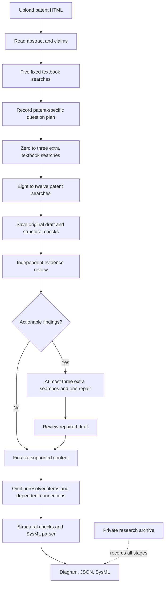

# Implemented research workflow

The app uses three OpenCode agents with the same configured model (`OPENCODE_MODEL`, default `openai/gpt-6-luna`). Each hosted visitor signs into their own ChatGPT account. Python controls file access, question budgets, review gates, cleanup, validation and persistence.

| Agent | Job |
| --- | --- |
| Orchestrator | Delegate each stage sequentially and finalize the reviewed result. |
| Functional decomposer | Read patent context, plan questions, retrieve evidence, draft the model and perform at most one repair. |
| Quality reviewer | Independently read the candidate and its cited passages, record findings, and review the repaired candidate. It cannot edit the model. |

## Fixed and dynamic questions

These five textbook queries remain unchanged and are enforced in order:

1. `functional decomposition verb noun pairs`
2. `black-box model inputs outputs flows`
3. `system interfaces context diagram`
4. `control regulation mechanisms`
5. `inventive claims novel functional elements`

The backend textbook is indexed once using the teammate's BM25 subsection retriever. Its saved index is rebuilt only when the book or extraction code changes. Each run searches that same index; no new embedding of the book is needed.

The decomposer first reads the uploaded patent's abstract and claims. If neither HTML selector exists, it receives a labeled body excerpt. Long context is explicitly marked as truncated. After the fixed searches, it saves a plan containing a patent summary, 0–3 modeling uncertainties, and 8–12 patent questions. Each uncertainty records the concrete patent context, the reason for asking, and a textbook query expressed in systems-engineering terms. Each patent question records its context, category and purpose.

For example, a patent describing a bellows and hydraulic reaction chambers might lead to a textbook query about `system boundary interface energy material signal flow classification`. The textbook supplies modeling guidance; the uploaded patent supplies evidence about the bellows. Textbook passages cannot establish invention facts.

Tool guards require the planned searches and enforce their budgets. Textbook retrieval uses `top_k=1`, with 4,000 characters per subsection. Patent retrieval uses `top_k=5`. Successful duplicate searches are rejected; failed calls remain recorded and can be retried.

## Review, repair and omission

The initial draft is immutable. Code checks view types, citations, IDs, claim references, interface endpoints and shared flows, hierarchy cycles and function/flow references. These checks establish consistency, not factual support.

The reviewer receives the candidate, context and evidence catalog. Exact passages are read in batches of at most three to avoid tool-response truncation. Every cited, available patent passage must have been opened before review can be saved. Six required review categories cover patent grounding, functional completeness, flow consistency, claim traceability, interfaces and textbook application. Findings include severity, an exact model JSON pointer, supporting evidence IDs and a suggested correction. Missing-content findings have no removal target.

Actionable findings trigger one repair pass, with at most three additional patent/textbook searches combined. The original draft, repair strategy, searches, revision and both reviews remain in the research record. The repaired draft requires another independent review.

Unresolved modeled items are omitted from the final product, along with dependent child functions, flows, claims and interfaces. Conservative omission removes a whole affected model item rather than leaving half an invalid item. Review notes, assumptions, warnings and removal explanations are retained only in the research record. Missing information stays absent. The final model is not a claim of complete patent coverage. If no structurally valid nonempty functional model remains, the app returns the research record without manufacturing a final diagram.

## Export and cleanup

The host clears this run's patent collection on success, failure or cancellation, and records the cleanup result. This never clears the textbook index. Captured research evidence remains retained by design.

SysML export is deterministic: nested actions for the function hierarchy and directed item flows with generic `FlowItem` payloads. Claims/interfaces remain documentation, not formal requirements or complete physical simulation semantics. The pinned SysIDE Legacy 0.9.1 language server checks the generated file against its 2024-12 grammar/library. This is a useful parser and semantic check, not certification against the final SysML 2.0 standard. Parser errors or unavailable validation prevent a successful generated export.

The three Gradio tabs remain Diagram, JSON text, and SysML download. A research ZIP download is inside the JSON tab. The uploader accepts patent HTML (.html or .htm) only. JSON is available as an output download and cannot be uploaded as input.

## Research record and persistence

See [RESEARCH_RECORD.md](RESEARCH_RECORD.md) for file layout, metric meanings, storage setup and limitations. The agents have only their named MCP tools; shell, general file access and external browsing are denied. Backend service tokens never reach agent subprocess environments. The original teammate code remains unchanged under `vendor/Info-extraction`; hosted behavior lives in small Python modules and `workflow.py`.
