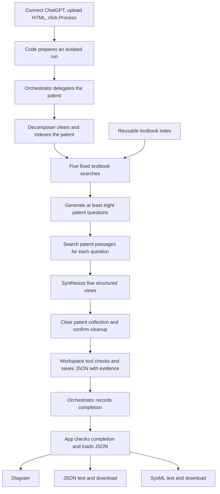

# Current agent structure

This describes the implemented HTML-patent workflow. It does not include the proposed patent-specific planning or review-and-repair loop.

## Two agents

| Agent | Responsibility |
| --- | --- |
| `patent-decomposition-orchestrator` | Receives the prepared patent paths, delegates to the decomposer, and records completion. |
| `patent-functional-decomposer` | Retrieves textbook guidance and patent evidence, generates questions, and synthesizes the five output views. |

OpenCode runs both roles with the configured model (`OPENCODE_MODEL`, default `openai/gpt-6-luna`). On the hosted app, each visitor connects their own ChatGPT account for their session. Retrieval and file-writing tools are ordinary code, not additional agents.



## What happens in order

1. **Backend startup.** The Space downloads the configured textbook and prepared index from its backend dataset. `textbook_index.py` loads the saved BM25 subsection index. It rebuilds only when the book, extraction code, or index format changes. This is separate from the patent vector database.
2. **Session and input checks.** The hosted HTML path requires a connected ChatGPT session. The runner accepts a nonempty HTML/HTM file under 10 MB, checks the backend textbook and OpenCode installation, and creates separate input, output, log, and database locations under `runs/`.
3. **Orchestration.** The runner starts OpenCode with the upstream agent instructions plus the hosted tool restrictions. The orchestrator obtains the prepared paths and invokes the decomposer for this one patent.
4. **Patent ingestion.** The decomposer clears its patent collection and calls the HTML ingestion tool. The tool extracts, chunks, and indexes the patent text. Its response provides the filename-based document title and chunk count; there is no separate abstract-and-claims reading step before question generation.
5. **Textbook guidance.** The decomposer is instructed to issue the five seed searches below. Each requests one subsection with at most 4,000 characters. The index is reused, but these five search results are currently retrieved again for each patent.
6. **Question generation.** The decomposer uses the textbook guidance to compose at least eight patent questions covering purpose, inputs, outputs, subfunctions, interfaces, control, constraints, and inventive elements. The prompt provides eight generic fallback questions if necessary.
7. **Patent retrieval.** Each question requests up to five patent passages. The capture wrapper records the full tool responses and passage IDs for inclusion in the result.
8. **Synthesis.** The decomposer creates the black-box model, functional decomposition tree, flow analysis, inventive function claims, and interface map. Its instructions require patent evidence for factual statements and use textbook context for vocabulary and modeling guidance. Assumptions and warnings are separate fields.
9. **Cleanup and saving.** Before saving, the decomposer clears the patent collection and confirms zero remaining records. It passes its views, assumptions, and warnings to `workspace.save_decomposition`. Code attaches the captured evidence, performs the checks below, and writes the JSON.
10. **Completion.** The orchestrator calls `workspace.finish_batch` to write a completion manifest. The runner requires a successful manifest, successful artifact, confirmed cleanup, structured views, and retained patent evidence before returning success.
11. **Rendering and export.** The Gradio app displays the JSON, uses Graphviz to render functions and flows, and uses `sysml_export.py` to generate SysML v2 text. These outputs do not require another AI call.

The fixed textbook searches are:

```text
functional decomposition verb noun pairs
black-box model inputs outputs flows
system interfaces context diagram
control regulation mechanisms
inventive claims novel functional elements
```

## Three tool groups

| Tool server | Tools used by the agents | Scope |
| --- | --- | --- |
| `patent_RAG_html` | `clear_database`, `ingest_html`, `query` | Only the uploaded patent and this run's collection/database. |
| `systems_eng_context` | `retrieve_subsection_context` | The configured backend textbook and saved subsection index. |
| `workspace` | `get_patent_info`, `save_decomposition`, `finish_batch` | Prepared paths and result files for this run. |

The orchestrator can delegate only to the configured decomposer. General shell, file, and web tools are denied. Backend service tokens are excluded from agent subprocess environments.

## Checks and their limits

Before saving, code requires successful ingestion, at least five textbook retrieval records, at least eight patent query records, all five view keys, and confirmed patent cleanup. It checks that cited patent passage IDs exist. The SysML exporter rejects duplicate function IDs, missing parents, hierarchy cycles, and unknown flow endpoints.

These checks do **not** prove that a citation supports its associated statement or that every engineering relationship was extracted. There is currently no mandatory evidence-driven review-and-repair pass, no automatic comparison between interface descriptions and modeled flows, and no SysML parser invoked during normal app processing. The separate parser checks used during development do not change this runtime behavior.

The exporter maps function hierarchy to nested actions and flow records to item flows using a generic `FlowItem` type. Other views and evidence references remain documentation. The JSON is the upstream functional-decomposition schema, not the separate GradResearch SJS schema.

Successful cleanup clears the patent collection; it does not delete saved uploads, evidence logs, or output files. Interrupted runs are not reported as successful cleanup. The textbook index is unaffected.

Uploading an existing result JSON bypasses the agents and goes directly to rendering/export. Fine Tuned NLP remains disabled.

## Where to edit

| File | Purpose |
| --- | --- |
| [agent_app.py](agent_app.py) | Gradio layout, callbacks, and output tabs. |
| [agent_runner.py](agent_runner.py) | Agent configuration, hosted instructions, permissions, launch, and completion checks. |
| [workspace_mcp.py](workspace_mcp.py) | Result assembly and structural checks. |
| [capture_mcp.py](capture_mcp.py) | Evidence capture and retrieval-tool access restrictions. |
| [textbook_index.py](textbook_index.py) | Reusable textbook index. |
| [sysml_export.py](sysml_export.py) | Deterministic JSON-to-SysML conversion. |
| [chatgpt_login.py](chatgpt_login.py), [user_session.py](user_session.py) | Per-session authentication and temporary credentials. |
| [space_app.py](space_app.py) | Hugging Face startup and backend asset download. |
| [styles.css](styles.css) | Appearance. |
| [vendor/Info-extraction](vendor/Info-extraction/) | Teammate's original agent prompts and retrieval implementation. |

Upstream files are copied from [eandujar09/Info-extraction](https://github.com/eandujar09/Info-extraction), commit `848d0337cce01bebc620da4a2b3d873c16ffb326`. Only the files needed by this app are included. No additional license grant over the upstream code is asserted.
